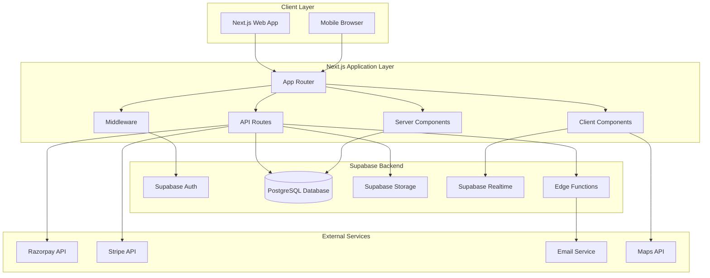
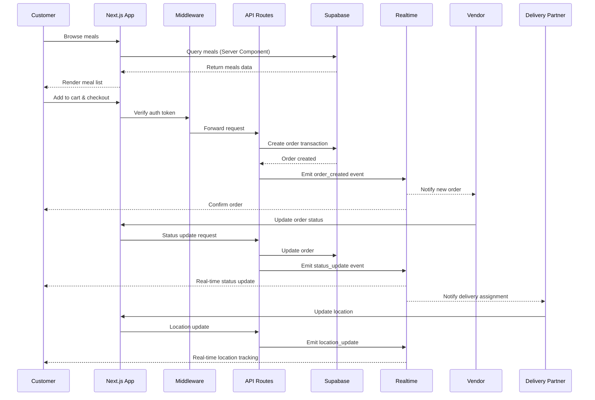
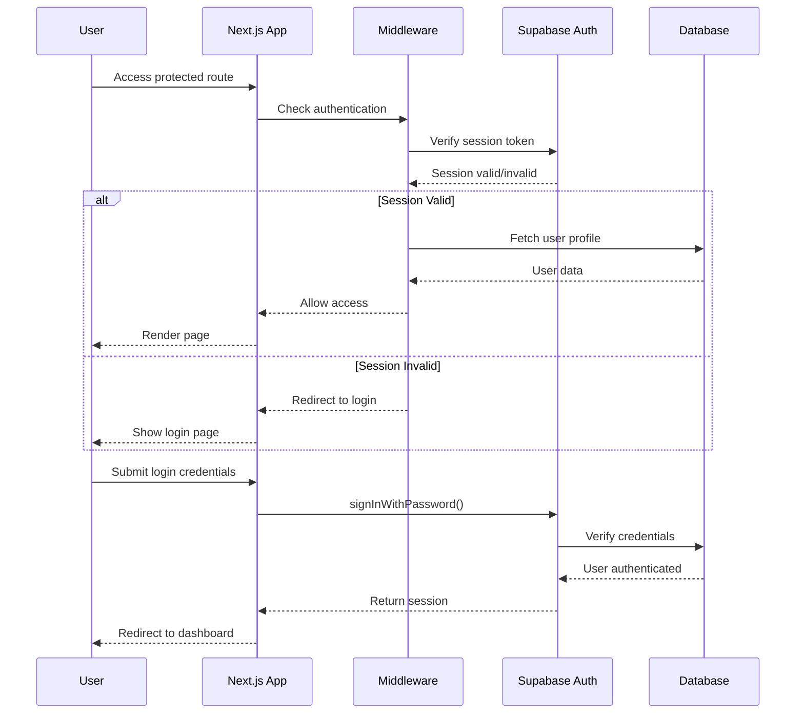

# Design Document: Rasan Food Delivery Platform

## Overview

Rasan is a comprehensive food delivery platform built with Next.js 14+ (App Router) and Supabase, connecting customers, vendors, delivery partners, and administrators. The platform features real-time order tracking, subscription management, smart delivery assignment, group orders with split payments, and role-based analytics dashboards. The architecture leverages Next.js server components for optimal performance, Supabase for database/auth/storage/realtime, and integrates Razorpay and Stripe for payments.

## Architecture

### System Architecture



### Data Flow Architecture



## Components and Interfaces

### Next.js App Structure

```
Rasan/
├── app/
│   ├── (auth)/
│   │   ├── login/
│   │   │   └── page.tsx
│   │   ├── register/
│   │   │   └── page.tsx
│   │   ├── forgot-password/
│   │   │   └── page.tsx
│   │   └── reset-password/
│   │       └── page.tsx
│   ├── (customer)/
│   │   ├── dashboard/
│   │   │   └── page.tsx
│   │   ├── orders/
│   │   │   ├── page.tsx
│   │   │   └── [id]/
│   │   │       └── page.tsx
│   │   ├── subscriptions/
│   │   │   └── page.tsx
│   │   ├── profile/
│   │   │   └── page.tsx
│   │   └── layout.tsx
│   ├── (vendor)/
│   │   ├── vendor-dashboard/
│   │   │   └── page.tsx
│   │   ├── menu-management/
│   │   │   └── page.tsx
│   │   ├── vendor-orders/
│   │   │   └── page.tsx
│   │   ├── analytics/
│   │   │   └── page.tsx
│   │   └── layout.tsx
│   ├── (delivery)/
│   │   ├── delivery-dashboard/
│   │   │   └── page.tsx
│   │   ├── available-orders/
│   │   │   └── page.tsx
│   │   ├── active-deliveries/
│   │   │   └── page.tsx
│   │   └── layout.tsx
│   ├── (admin)/
│   │   ├── admin-dashboard/
│   │   │   └── page.tsx
│   │   ├── users/
│   │   │   └── page.tsx
│   │   ├── vendors/
│   │   │   └── page.tsx
│   │   └── layout.tsx
│   ├── api/
│   │   ├── auth/
│   │   │   └── route.ts
│   │   ├── meals/
│   │   │   └── route.ts
│   │   ├── orders/
│   │   │   └── route.ts
│   │   ├── payments/
│   │   │   └── route.ts
│   │   └── webhooks/
│   │       └── route.ts
│   ├── meals/
│   │   ├── page.tsx
│   │   └── [id]/
│   │       └── page.tsx
│   ├── vendors/
│   │   ├── page.tsx
│   │   └── [id]/
│   │       └── page.tsx
│   ├── cart/
│   │   └── page.tsx
│   ├── checkout/
│   │   └── page.tsx
│   ├── about/
│   │   └── page.tsx
│   ├── contact/
│   │   └── page.tsx
│   ├── layout.tsx
│   ├── page.tsx
│   └── middleware.ts
├── components/
│   ├── ui/
│   │   ├── button.tsx
│   │   ├── card.tsx
│   │   ├── input.tsx
│   │   ├── badge.tsx
│   │   ├── dialog.tsx
│   │   ├── dropdown-menu.tsx
│   │   ├── table.tsx
│   │   ├── tabs.tsx
│   │   └── toast.tsx
│   ├── layout/
│   │   ├── header.tsx
│   │   ├── footer.tsx
│   │   ├── sidebar.tsx
│   │   └── mobile-nav.tsx
│   ├── meals/
│   │   ├── meal-card.tsx
│   │   ├── meal-list.tsx
│   │   ├── meal-filters.tsx
│   │   └── meal-details.tsx
│   ├── cart/
│   │   ├── cart-item.tsx
│   │   ├── cart-summary.tsx
│   │   └── cart-drawer.tsx
│   ├── orders/
│   │   ├── order-card.tsx
│   │   ├── order-tracker.tsx
│   │   └── order-status.tsx
│   ├── vendor/
│   │   ├── vendor-card.tsx
│   │   ├── menu-item-form.tsx
│   │   └── order-management.tsx
│   ├── delivery/
│   │   ├── delivery-map.tsx
│   │   ├── location-tracker.tsx
│   │   └── delivery-status.tsx
│   ├── subscriptions/
│   │   ├── plan-selector.tsx
│   │   ├── subscription-card.tsx
│   │   └── working-days-selector.tsx
│   ├── payments/
│   │   ├── razorpay-button.tsx
│   │   ├── stripe-checkout.tsx
│   │   └── payment-method-selector.tsx
│   └── analytics/
│       ├── stats-card.tsx
│       ├── revenue-chart.tsx
│       └── orders-chart.tsx
├── lib/
│   ├── supabase/
│   │   ├── client.ts
│   │   ├── server.ts
│   │   ├── middleware.ts
│   │   └── types.ts
│   ├── utils/
│   │   ├── cn.ts
│   │   ├── format.ts
│   │   └── validation.ts
│   ├── hooks/
│   │   ├── use-auth.ts
│   │   ├── use-cart.ts
│   │   ├── use-realtime.ts
│   │   └── use-toast.ts
│   └── services/
│       ├── meal-service.ts
│       ├── order-service.ts
│       ├── payment-service.ts
│       └── notification-service.ts
├── types/
│   ├── database.types.ts
│   ├── supabase.ts
│   └── index.ts
├── styles/
│   └── globals.css
├── public/
│   ├── images/
│   └── icons/
├── supabase/
│   ├── migrations/
│   │   ├── 001_initial_schema.sql
│   │   ├── 002_rls_policies.sql
│   │   └── 003_functions.sql
│   ├── functions/
│   │   ├── send-notification/
│   │   └── process-payment/
│   └── config.toml
├── .env.local
├── .env.example
├── next.config.js
├── tailwind.config.ts
├── tsconfig.json
└── package.json
```

### Core Interfaces and Types

```typescript
// types/database.types.ts

export type UserRole = 'customer' | 'vendor' | 'delivery' | 'admin';

export type OrderStatus = 
  | 'pending' 
  | 'confirmed' 
  | 'preparing' 
  | 'ready' 
  | 'picked_up' 
  | 'out_for_delivery' 
  | 'delivered' 
  | 'cancelled';

export type PaymentStatus = 'pending' | 'paid' | 'failed' | 'refunded';

export type PaymentMethod = 'cash' | 'card' | 'upi' | 'wallet';

export type SubscriptionStatus = 'active' | 'paused' | 'cancelled' | 'completed';

export type MealType = 'breakfast' | 'lunch' | 'dinner' | 'snack';

export type VehicleType = 'bike' | 'scooter' | 'car';

export interface Database {
  public: {
    Tables: {
      profiles: {
        Row: {
          id: string;
          email: string;
          name: string;
          phone: string | null;
          role: UserRole;
          avatar_url: string | null;
          address: Address | null;
          is_active: boolean;
          is_verified: boolean;
          created_at: string;
          updated_at: string;
        };
        Insert: Omit<Database['public']['Tables']['profiles']['Row'], 'id' | 'created_at' | 'updated_at'>;
        Update: Partial<Database['public']['Tables']['profiles']['Insert']>;
      };
      vendors: {
        Row: {
          id: string;
          user_id: string;
          business_name: string;
          description: string | null;
          cuisine: string[];
          location: Point;
          address: string;
          phone: string;
          email: string;
          operating_hours: OperatingHours;
          rating: number;
          total_orders: number;
          is_active: boolean;
          bank_details: BankDetails | null;
          documents: VendorDocuments | null;
          created_at: string;
          updated_at: string;
        };
        Insert: Omit<Database['public']['Tables']['vendors']['Row'], 'id' | 'created_at' | 'updated_at'>;
        Update: Partial<Database['public']['Tables']['vendors']['Insert']>;
      };
      meals: {
        Row: {
          id: string;
          vendor_id: string;
          name: string;
          description: string | null;
          category: string;
          meal_type: MealType;
          price: number;
          discount_price: number | null;
          image_url: string | null;
          ingredients: string[];
          allergens: string[];
          nutritional_info: NutritionalInfo | null;
          is_veg: boolean;
          is_available: boolean;
          stock: number | null;
          preparation_time: number;
          rating: number;
          created_at: string;
          updated_at: string;
        };
        Insert: Omit<Database['public']['Tables']['meals']['Row'], 'id' | 'created_at' | 'updated_at'>;
        Update: Partial<Database['public']['Tables']['meals']['Insert']>;
      };
      orders: {
        Row: {
          id: string;
          order_number: string;
          customer_id: string;
          vendor_id: string;
          delivery_partner_id: string | null;
          items: OrderItem[];
          subtotal: number;
          delivery_fee: number;
          tax: number;
          discount: number;
          total: number;
          status: OrderStatus;
          payment_status: PaymentStatus;
          payment_method: PaymentMethod;
          payment_id: string | null;
          delivery_address: Address;
          delivery_instructions: string | null;
          estimated_delivery_time: string | null;
          actual_delivery_time: string | null;
          tracking_updates: TrackingUpdate[];
          rating: OrderRating | null;
          created_at: string;
          updated_at: string;
        };
        Insert: Omit<Database['public']['Tables']['orders']['Row'], 'id' | 'order_number' | 'created_at' | 'updated_at'>;
        Update: Partial<Database['public']['Tables']['orders']['Insert']>;
      };
      delivery_partners: {
        Row: {
          id: string;
          user_id: string;
          vehicle_type: VehicleType;
          vehicle_number: string;
          license_number: string;
          is_online: boolean;
          current_location: Point | null;
          rating: number;
          total_deliveries: number;
          earnings: Earnings;
          documents: DeliveryDocuments | null;
          bank_details: BankDetails | null;
          is_verified: boolean;
          created_at: string;
          updated_at: string;
        };
        Insert: Omit<Database['public']['Tables']['delivery_partners']['Row'], 'id' | 'created_at' | 'updated_at'>;
        Update: Partial<Database['public']['Tables']['delivery_partners']['Insert']>;
      };
      subscriptions: {
        Row: {
          id: string;
          customer_id: string;
          vendor_id: string;
          plan_type: 'daily' | 'weekly' | 'monthly';
          meal_type: MealType | 'all';
          start_date: string;
          end_date: string;
          delivery_days: string[];
          delivery_time: string;
          address: Address;
          price: number;
          status: SubscriptionStatus;
          payment_status: PaymentStatus;
          auto_renew: boolean;
          deliveries: SubscriptionDelivery[];
          created_at: string;
          updated_at: string;
        };
        Insert: Omit<Database['public']['Tables']['subscriptions']['Row'], 'id' | 'created_at' | 'updated_at'>;
        Update: Partial<Database['public']['Tables']['subscriptions']['Insert']>;
      };
      notifications: {
        Row: {
          id: string;
          user_id: string;
          type: 'order' | 'delivery' | 'payment' | 'promotion' | 'system';
          title: string;
          message: string;
          data: Record<string, any> | null;
          is_read: boolean;
          created_at: string;
        };
        Insert: Omit<Database['public']['Tables']['notifications']['Row'], 'id' | 'created_at'>;
        Update: Partial<Database['public']['Tables']['notifications']['Insert']>;
      };
      categories: {
        Row: {
          id: string;
          name: string;
          description: string | null;
          image_url: string | null;
          is_active: boolean;
          created_at: string;
          updated_at: string;
        };
        Insert: Omit<Database['public']['Tables']['categories']['Row'], 'id' | 'created_at' | 'updated_at'>;
        Update: Partial<Database['public']['Tables']['categories']['Insert']>;
      };
      reviews: {
        Row: {
          id: string;
          meal_id: string;
          user_id: string;
          order_id: string;
          rating: number;
          comment: string | null;
          images: string[];
          created_at: string;
          updated_at: string;
        };
        Insert: Omit<Database['public']['Tables']['reviews']['Row'], 'id' | 'created_at' | 'updated_at'>;
        Update: Partial<Database['public']['Tables']['reviews']['Insert']>;
      };
      group_orders: {
        Row: {
          id: string;
          group_id: string;
          host_id: string;
          vendor_id: string;
          participants: GroupParticipant[];
          status: 'open' | 'closed' | 'ordered';
          expires_at: string;
          created_at: string;
          updated_at: string;
        };
        Insert: Omit<Database['public']['Tables']['group_orders']['Row'], 'id' | 'created_at' | 'updated_at'>;
        Update: Partial<Database['public']['Tables']['group_orders']['Insert']>;
      };
      plan_pricing: {
        Row: {
          id: string;
          plan_type: 'daily' | 'weekly' | 'monthly';
          meal_type: MealType | 'all';
          days_per_week: number;
          base_price: number;
          discount_percentage: number;
          final_price: number;
          is_active: boolean;
          created_at: string;
          updated_at: string;
        };
        Insert: Omit<Database['public']['Tables']['plan_pricing']['Row'], 'id' | 'created_at' | 'updated_at'>;
        Update: Partial<Database['public']['Tables']['plan_pricing']['Insert']>;
      };
    };
    Views: {
      [_ in never]: never;
    };
    Functions: {
      nearby_vendors: {
        Args: { lat: number; lng: number; radius_km: number };
        Returns: Database['public']['Tables']['vendors']['Row'][];
      };
      assign_delivery_partner: {
        Args: { order_id: string };
        Returns: string | null;
      };
      calculate_delivery_fee: {
        Args: { vendor_location: Point; delivery_location: Point };
        Returns: number;
      };
    };
    Enums: {
      user_role: UserRole;
      order_status: OrderStatus;
      payment_status: PaymentStatus;
      payment_method: PaymentMethod;
      subscription_status: SubscriptionStatus;
      meal_type: MealType;
      vehicle_type: VehicleType;
    };
  };
}

// Supporting types
export interface Address {
  street: string;
  city: string;
  state: string;
  zip_code: string;
  coordinates: { lat: number; lng: number };
}

export interface Point {
  type: 'Point';
  coordinates: [number, number]; // [longitude, latitude]
}

export interface OperatingHours {
  monday: DaySchedule;
  tuesday: DaySchedule;
  wednesday: DaySchedule;
  thursday: DaySchedule;
  friday: DaySchedule;
  saturday: DaySchedule;
  sunday: DaySchedule;
}

export interface DaySchedule {
  is_open: boolean;
  open_time: string;
  close_time: string;
}

export interface BankDetails {
  account_number: string;
  ifsc_code: string;
  account_holder_name: string;
}

export interface VendorDocuments {
  fssai_license: string;
  gst_number: string;
}

export interface DeliveryDocuments {
  driving_license: string;
  vehicle_rc: string;
  insurance: string;
}

export interface NutritionalInfo {
  calories: number;
  protein: number;
  carbs: number;
  fat: number;
}

export interface OrderItem {
  meal_id: string;
  name: string;
  quantity: number;
  price: number;
  customizations: string[];
}

export interface TrackingUpdate {
  status: OrderStatus;
  timestamp: string;
  location: { lat: number; lng: number } | null;
  note: string | null;
}

export interface OrderRating {
  food: number;
  delivery: number;
  comment: string | null;
}

export interface Earnings {
  today: number;
  this_week: number;
  this_month: number;
  total: number;
}

export interface SubscriptionDelivery {
  date: string;
  status: 'scheduled' | 'delivered' | 'skipped' | 'failed';
  order_id: string | null;
}

export interface GroupParticipant {
  user_id: string;
  items: { meal_id: string; quantity: number }[];
  contribution: number;
}
```


## Data Models

### Supabase Database Schema

```sql
-- Enable necessary extensions
CREATE EXTENSION IF NOT EXISTS "uuid-ossp";
CREATE EXTENSION IF NOT EXISTS "postgis";

-- Create enums
CREATE TYPE user_role AS ENUM ('customer', 'vendor', 'delivery', 'admin');
CREATE TYPE order_status AS ENUM ('pending', 'confirmed', 'preparing', 'ready', 'picked_up', 'out_for_delivery', 'delivered', 'cancelled');
CREATE TYPE payment_status AS ENUM ('pending', 'paid', 'failed', 'refunded');
CREATE TYPE payment_method AS ENUM ('cash', 'card', 'upi', 'wallet');
CREATE TYPE subscription_status AS ENUM ('active', 'paused', 'cancelled', 'completed');
CREATE TYPE meal_type AS ENUM ('breakfast', 'lunch', 'dinner', 'snack');
CREATE TYPE vehicle_type AS ENUM ('bike', 'scooter', 'car');

-- Profiles table (extends Supabase auth.users)
CREATE TABLE profiles (
  id UUID PRIMARY KEY REFERENCES auth.users(id) ON DELETE CASCADE,
  email TEXT UNIQUE NOT NULL,
  name TEXT NOT NULL,
  phone TEXT,
  role user_role NOT NULL DEFAULT 'customer',
  avatar_url TEXT,
  address JSONB,
  is_active BOOLEAN DEFAULT true,
  is_verified BOOLEAN DEFAULT false,
  created_at TIMESTAMPTZ DEFAULT NOW(),
  updated_at TIMESTAMPTZ DEFAULT NOW()
);

-- Vendors table
CREATE TABLE vendors (
  id UUID PRIMARY KEY DEFAULT uuid_generate_v4(),
  user_id UUID REFERENCES profiles(id) ON DELETE CASCADE,
  business_name TEXT NOT NULL,
  description TEXT,
  cuisine TEXT[],
  location GEOGRAPHY(POINT, 4326) NOT NULL,
  address TEXT NOT NULL,
  phone TEXT NOT NULL,
  email TEXT NOT NULL,
  operating_hours JSONB NOT NULL,
  rating NUMERIC(3, 2) DEFAULT 0,
  total_orders INTEGER DEFAULT 0,
  is_active BOOLEAN DEFAULT true,
  bank_details JSONB,
  documents JSONB,
  created_at TIMESTAMPTZ DEFAULT NOW(),
  updated_at TIMESTAMPTZ DEFAULT NOW()
);

-- Create spatial index for vendors
CREATE INDEX idx_vendors_location ON vendors USING GIST(location);

-- Meals table
CREATE TABLE meals (
  id UUID PRIMARY KEY DEFAULT uuid_generate_v4(),
  vendor_id UUID REFERENCES vendors(id) ON DELETE CASCADE,
  name TEXT NOT NULL,
  description TEXT,
  category TEXT NOT NULL,
  meal_type meal_type NOT NULL,
  price NUMERIC(10, 2) NOT NULL,
  discount_price NUMERIC(10, 2),
  image_url TEXT,
  ingredients TEXT[],
  allergens TEXT[],
  nutritional_info JSONB,
  is_veg BOOLEAN DEFAULT true,
  is_available BOOLEAN DEFAULT true,
  stock INTEGER,
  preparation_time INTEGER NOT NULL,
  rating NUMERIC(3, 2) DEFAULT 0,
  created_at TIMESTAMPTZ DEFAULT NOW(),
  updated_at TIMESTAMPTZ DEFAULT NOW()
);

-- Orders table
CREATE TABLE orders (
  id UUID PRIMARY KEY DEFAULT uuid_generate_v4(),
  order_number TEXT UNIQUE NOT NULL,
  customer_id UUID REFERENCES profiles(id) ON DELETE SET NULL,
  vendor_id UUID REFERENCES vendors(id) ON DELETE SET NULL,
  delivery_partner_id UUID REFERENCES delivery_partners(id) ON DELETE SET NULL,
  items JSONB NOT NULL,
  subtotal NUMERIC(10, 2) NOT NULL,
  delivery_fee NUMERIC(10, 2) NOT NULL,
  tax NUMERIC(10, 2) NOT NULL,
  discount NUMERIC(10, 2) DEFAULT 0,
  total NUMERIC(10, 2) NOT NULL,
  status order_status DEFAULT 'pending',
  payment_status payment_status DEFAULT 'pending',
  payment_method payment_method NOT NULL,
  payment_id TEXT,
  delivery_address JSONB NOT NULL,
  delivery_instructions TEXT,
  estimated_delivery_time TIMESTAMPTZ,
  actual_delivery_time TIMESTAMPTZ,
  tracking_updates JSONB DEFAULT '[]'::jsonb,
  rating JSONB,
  created_at TIMESTAMPTZ DEFAULT NOW(),
  updated_at TIMESTAMPTZ DEFAULT NOW()
);

-- Delivery Partners table
CREATE TABLE delivery_partners (
  id UUID PRIMARY KEY DEFAULT uuid_generate_v4(),
  user_id UUID REFERENCES profiles(id) ON DELETE CASCADE,
  vehicle_type vehicle_type NOT NULL,
  vehicle_number TEXT NOT NULL,
  license_number TEXT NOT NULL,
  is_online BOOLEAN DEFAULT false,
  current_location GEOGRAPHY(POINT, 4326),
  rating NUMERIC(3, 2) DEFAULT 0,
  total_deliveries INTEGER DEFAULT 0,
  earnings JSONB DEFAULT '{"today": 0, "this_week": 0, "this_month": 0, "total": 0}'::jsonb,
  documents JSONB,
  bank_details JSONB,
  is_verified BOOLEAN DEFAULT false,
  created_at TIMESTAMPTZ DEFAULT NOW(),
  updated_at TIMESTAMPTZ DEFAULT NOW()
);

-- Create spatial index for delivery partners
CREATE INDEX idx_delivery_partners_location ON delivery_partners USING GIST(current_location);

-- Subscriptions table
CREATE TABLE subscriptions (
  id UUID PRIMARY KEY DEFAULT uuid_generate_v4(),
  customer_id UUID REFERENCES profiles(id) ON DELETE CASCADE,
  vendor_id UUID REFERENCES vendors(id) ON DELETE CASCADE,
  plan_type TEXT NOT NULL CHECK (plan_type IN ('daily', 'weekly', 'monthly')),
  meal_type TEXT NOT NULL,
  start_date DATE NOT NULL,
  end_date DATE NOT NULL,
  delivery_days TEXT[],
  delivery_time TIME NOT NULL,
  address JSONB NOT NULL,
  price NUMERIC(10, 2) NOT NULL,
  status subscription_status DEFAULT 'active',
  payment_status payment_status DEFAULT 'pending',
  auto_renew BOOLEAN DEFAULT false,
  deliveries JSONB DEFAULT '[]'::jsonb,
  created_at TIMESTAMPTZ DEFAULT NOW(),
  updated_at TIMESTAMPTZ DEFAULT NOW()
);

-- Notifications table
CREATE TABLE notifications (
  id UUID PRIMARY KEY DEFAULT uuid_generate_v4(),
  user_id UUID REFERENCES profiles(id) ON DELETE CASCADE,
  type TEXT NOT NULL CHECK (type IN ('order', 'delivery', 'payment', 'promotion', 'system')),
  title TEXT NOT NULL,
  message TEXT NOT NULL,
  data JSONB,
  is_read BOOLEAN DEFAULT false,
  created_at TIMESTAMPTZ DEFAULT NOW()
);

-- Categories table
CREATE TABLE categories (
  id UUID PRIMARY KEY DEFAULT uuid_generate_v4(),
  name TEXT UNIQUE NOT NULL,
  description TEXT,
  image_url TEXT,
  is_active BOOLEAN DEFAULT true,
  created_at TIMESTAMPTZ DEFAULT NOW(),
  updated_at TIMESTAMPTZ DEFAULT NOW()
);

-- Reviews table
CREATE TABLE reviews (
  id UUID PRIMARY KEY DEFAULT uuid_generate_v4(),
  meal_id UUID REFERENCES meals(id) ON DELETE CASCADE,
  user_id UUID REFERENCES profiles(id) ON DELETE CASCADE,
  order_id UUID REFERENCES orders(id) ON DELETE CASCADE,
  rating INTEGER NOT NULL CHECK (rating >= 1 AND rating <= 5),
  comment TEXT,
  images TEXT[],
  created_at TIMESTAMPTZ DEFAULT NOW(),
  updated_at TIMESTAMPTZ DEFAULT NOW(),
  UNIQUE(meal_id, user_id, order_id)
);

-- Group Orders table
CREATE TABLE group_orders (
  id UUID PRIMARY KEY DEFAULT uuid_generate_v4(),
  group_id TEXT UNIQUE NOT NULL,
  host_id UUID REFERENCES profiles(id) ON DELETE CASCADE,
  vendor_id UUID REFERENCES vendors(id) ON DELETE CASCADE,
  participants JSONB DEFAULT '[]'::jsonb,
  status TEXT DEFAULT 'open' CHECK (status IN ('open', 'closed', 'ordered')),
  expires_at TIMESTAMPTZ NOT NULL,
  created_at TIMESTAMPTZ DEFAULT NOW(),
  updated_at TIMESTAMPTZ DEFAULT NOW()
);

-- Plan Pricing table
CREATE TABLE plan_pricing (
  id UUID PRIMARY KEY DEFAULT uuid_generate_v4(),
  plan_type TEXT NOT NULL CHECK (plan_type IN ('daily', 'weekly', 'monthly')),
  meal_type TEXT NOT NULL,
  days_per_week INTEGER NOT NULL,
  base_price NUMERIC(10, 2) NOT NULL,
  discount_percentage NUMERIC(5, 2) DEFAULT 0,
  final_price NUMERIC(10, 2) NOT NULL,
  is_active BOOLEAN DEFAULT true,
  created_at TIMESTAMPTZ DEFAULT NOW(),
  updated_at TIMESTAMPTZ DEFAULT NOW()
);

-- Create indexes for performance
CREATE INDEX idx_meals_vendor_id ON meals(vendor_id);
CREATE INDEX idx_meals_category ON meals(category);
CREATE INDEX idx_meals_meal_type ON meals(meal_type);
CREATE INDEX idx_meals_is_available ON meals(is_available);
CREATE INDEX idx_orders_customer_id ON orders(customer_id);
CREATE INDEX idx_orders_vendor_id ON orders(vendor_id);
CREATE INDEX idx_orders_delivery_partner_id ON orders(delivery_partner_id);
CREATE INDEX idx_orders_status ON orders(status);
CREATE INDEX idx_orders_created_at ON orders(created_at DESC);
CREATE INDEX idx_subscriptions_customer_id ON subscriptions(customer_id);
CREATE INDEX idx_subscriptions_vendor_id ON subscriptions(vendor_id);
CREATE INDEX idx_subscriptions_status ON subscriptions(status);
CREATE INDEX idx_notifications_user_id ON notifications(user_id);
CREATE INDEX idx_notifications_is_read ON notifications(is_read);
CREATE INDEX idx_reviews_meal_id ON reviews(meal_id);
CREATE INDEX idx_reviews_user_id ON reviews(user_id);

-- Create updated_at trigger function
CREATE OR REPLACE FUNCTION update_updated_at_column()
RETURNS TRIGGER AS $$
BEGIN
  NEW.updated_at = NOW();
  RETURN NEW;
END;
$$ LANGUAGE plpgsql;

-- Apply updated_at trigger to tables
CREATE TRIGGER update_profiles_updated_at BEFORE UPDATE ON profiles
  FOR EACH ROW EXECUTE FUNCTION update_updated_at_column();
CREATE TRIGGER update_vendors_updated_at BEFORE UPDATE ON vendors
  FOR EACH ROW EXECUTE FUNCTION update_updated_at_column();
CREATE TRIGGER update_meals_updated_at BEFORE UPDATE ON meals
  FOR EACH ROW EXECUTE FUNCTION update_updated_at_column();
CREATE TRIGGER update_orders_updated_at BEFORE UPDATE ON orders
  FOR EACH ROW EXECUTE FUNCTION update_updated_at_column();
CREATE TRIGGER update_delivery_partners_updated_at BEFORE UPDATE ON delivery_partners
  FOR EACH ROW EXECUTE FUNCTION update_updated_at_column();
CREATE TRIGGER update_subscriptions_updated_at BEFORE UPDATE ON subscriptions
  FOR EACH ROW EXECUTE FUNCTION update_updated_at_column();
CREATE TRIGGER update_categories_updated_at BEFORE UPDATE ON categories
  FOR EACH ROW EXECUTE FUNCTION update_updated_at_column();
CREATE TRIGGER update_reviews_updated_at BEFORE UPDATE ON reviews
  FOR EACH ROW EXECUTE FUNCTION update_updated_at_column();
CREATE TRIGGER update_group_orders_updated_at BEFORE UPDATE ON group_orders
  FOR EACH ROW EXECUTE FUNCTION update_updated_at_column();
CREATE TRIGGER update_plan_pricing_updated_at BEFORE UPDATE ON plan_pricing
  FOR EACH ROW EXECUTE FUNCTION update_updated_at_column();

-- Generate order number function
CREATE OR REPLACE FUNCTION generate_order_number()
RETURNS TEXT AS $$
DECLARE
  new_order_number TEXT;
BEGIN
  new_order_number := 'ORD-' || TO_CHAR(NOW(), 'YYYYMMDD') || '-' || LPAD(FLOOR(RANDOM() * 10000)::TEXT, 4, '0');
  RETURN new_order_number;
END;
$$ LANGUAGE plpgsql;

-- Auto-generate order number trigger
CREATE OR REPLACE FUNCTION set_order_number()
RETURNS TRIGGER AS $$
BEGIN
  IF NEW.order_number IS NULL THEN
    NEW.order_number := generate_order_number();
  END IF;
  RETURN NEW;
END;
$$ LANGUAGE plpgsql;

CREATE TRIGGER set_order_number_trigger BEFORE INSERT ON orders
  FOR EACH ROW EXECUTE FUNCTION set_order_number();
```

### Row Level Security (RLS) Policies

```sql
-- Enable RLS on all tables
ALTER TABLE profiles ENABLE ROW LEVEL SECURITY;
ALTER TABLE vendors ENABLE ROW LEVEL SECURITY;
ALTER TABLE meals ENABLE ROW LEVEL SECURITY;
ALTER TABLE orders ENABLE ROW LEVEL SECURITY;
ALTER TABLE delivery_partners ENABLE ROW LEVEL SECURITY;
ALTER TABLE subscriptions ENABLE ROW LEVEL SECURITY;
ALTER TABLE notifications ENABLE ROW LEVEL SECURITY;
ALTER TABLE categories ENABLE ROW LEVEL SECURITY;
ALTER TABLE reviews ENABLE ROW LEVEL SECURITY;
ALTER TABLE group_orders ENABLE ROW LEVEL SECURITY;
ALTER TABLE plan_pricing ENABLE ROW LEVEL SECURITY;

-- Profiles policies
CREATE POLICY "Users can view their own profile" ON profiles
  FOR SELECT USING (auth.uid() = id);

CREATE POLICY "Users can update their own profile" ON profiles
  FOR UPDATE USING (auth.uid() = id);

CREATE POLICY "Anyone can view active profiles" ON profiles
  FOR SELECT USING (is_active = true);

-- Vendors policies
CREATE POLICY "Anyone can view active vendors" ON vendors
  FOR SELECT USING (is_active = true);

CREATE POLICY "Vendors can update their own data" ON vendors
  FOR UPDATE USING (user_id = auth.uid());

CREATE POLICY "Vendors can insert their own data" ON vendors
  FOR INSERT WITH CHECK (user_id = auth.uid());

-- Meals policies
CREATE POLICY "Anyone can view available meals" ON meals
  FOR SELECT USING (is_available = true);

CREATE POLICY "Vendors can manage their own meals" ON meals
  FOR ALL USING (
    vendor_id IN (SELECT id FROM vendors WHERE user_id = auth.uid())
  );

-- Orders policies
CREATE POLICY "Customers can view their own orders" ON orders
  FOR SELECT USING (customer_id = auth.uid());

CREATE POLICY "Vendors can view their orders" ON orders
  FOR SELECT USING (
    vendor_id IN (SELECT id FROM vendors WHERE user_id = auth.uid())
  );

CREATE POLICY "Delivery partners can view assigned orders" ON orders
  FOR SELECT USING (
    delivery_partner_id IN (SELECT id FROM delivery_partners WHERE user_id = auth.uid())
  );

CREATE POLICY "Customers can create orders" ON orders
  FOR INSERT WITH CHECK (customer_id = auth.uid());

CREATE POLICY "Vendors can update order status" ON orders
  FOR UPDATE USING (
    vendor_id IN (SELECT id FROM vendors WHERE user_id = auth.uid())
  );

CREATE POLICY "Delivery partners can update delivery status" ON orders
  FOR UPDATE USING (
    delivery_partner_id IN (SELECT id FROM delivery_partners WHERE user_id = auth.uid())
  );

-- Delivery Partners policies
CREATE POLICY "Anyone can view verified delivery partners" ON delivery_partners
  FOR SELECT USING (is_verified = true);

CREATE POLICY "Delivery partners can update their own data" ON delivery_partners
  FOR UPDATE USING (user_id = auth.uid());

CREATE POLICY "Delivery partners can insert their own data" ON delivery_partners
  FOR INSERT WITH CHECK (user_id = auth.uid());

-- Subscriptions policies
CREATE POLICY "Customers can view their own subscriptions" ON subscriptions
  FOR SELECT USING (customer_id = auth.uid());

CREATE POLICY "Vendors can view their subscriptions" ON subscriptions
  FOR SELECT USING (
    vendor_id IN (SELECT id FROM vendors WHERE user_id = auth.uid())
  );

CREATE POLICY "Customers can create subscriptions" ON subscriptions
  FOR INSERT WITH CHECK (customer_id = auth.uid());

CREATE POLICY "Customers can update their own subscriptions" ON subscriptions
  FOR UPDATE USING (customer_id = auth.uid());

-- Notifications policies
CREATE POLICY "Users can view their own notifications" ON notifications
  FOR SELECT USING (user_id = auth.uid());

CREATE POLICY "Users can update their own notifications" ON notifications
  FOR UPDATE USING (user_id = auth.uid());

-- Categories policies
CREATE POLICY "Anyone can view active categories" ON categories
  FOR SELECT USING (is_active = true);

-- Reviews policies
CREATE POLICY "Anyone can view reviews" ON reviews
  FOR SELECT USING (true);

CREATE POLICY "Users can create reviews for their orders" ON reviews
  FOR INSERT WITH CHECK (user_id = auth.uid());

CREATE POLICY "Users can update their own reviews" ON reviews
  FOR UPDATE USING (user_id = auth.uid());

-- Group Orders policies
CREATE POLICY "Participants can view group orders" ON group_orders
  FOR SELECT USING (
    host_id = auth.uid() OR
    auth.uid()::text = ANY(
      SELECT jsonb_array_elements(participants)->>'user_id'
    )
  );

CREATE POLICY "Host can create group orders" ON group_orders
  FOR INSERT WITH CHECK (host_id = auth.uid());

CREATE POLICY "Host can update group orders" ON group_orders
  FOR UPDATE USING (host_id = auth.uid());

-- Plan Pricing policies
CREATE POLICY "Anyone can view active plans" ON plan_pricing
  FOR SELECT USING (is_active = true);
```

### Database Functions

```sql
-- Function to find nearby vendors
CREATE OR REPLACE FUNCTION nearby_vendors(
  user_lat FLOAT,
  user_lng FLOAT,
  radius_km FLOAT DEFAULT 10
)
RETURNS TABLE (
  id UUID,
  business_name TEXT,
  cuisine TEXT[],
  rating NUMERIC,
  distance_km FLOAT
) AS $$
BEGIN
  RETURN QUERY
  SELECT 
    v.id,
    v.business_name,
    v.cuisine,
    v.rating,
    ST_Distance(
      v.location::geography,
      ST_SetSRID(ST_MakePoint(user_lng, user_lat), 4326)::geography
    ) / 1000 AS distance_km
  FROM vendors v
  WHERE 
    v.is_active = true AND
    ST_DWithin(
      v.location::geography,
      ST_SetSRID(ST_MakePoint(user_lng, user_lat), 4326)::geography,
      radius_km * 1000
    )
  ORDER BY distance_km;
END;
$$ LANGUAGE plpgsql;

-- Function to assign delivery partner
CREATE OR REPLACE FUNCTION assign_delivery_partner(p_order_id UUID)
RETURNS UUID AS $$
DECLARE
  v_order_location GEOGRAPHY;
  v_delivery_partner_id UUID;
BEGIN
  -- Get order delivery location
  SELECT ST_SetSRID(
    ST_MakePoint(
      (delivery_address->>'coordinates')::jsonb->>'lng',
      (delivery_address->>'coordinates')::jsonb->>'lat'
    ), 4326
  )::geography
  INTO v_order_location
  FROM orders
  WHERE id = p_order_id;
  
  -- Find nearest available delivery partner
  SELECT dp.id
  INTO v_delivery_partner_id
  FROM delivery_partners dp
  WHERE 
    dp.is_online = true AND
    dp.is_verified = true AND
    dp.id NOT IN (
      SELECT delivery_partner_id 
      FROM orders 
      WHERE status IN ('picked_up', 'out_for_delivery')
      AND delivery_partner_id IS NOT NULL
    )
  ORDER BY ST_Distance(dp.current_location, v_order_location)
  LIMIT 1;
  
  -- Update order with assigned delivery partner
  IF v_delivery_partner_id IS NOT NULL THEN
    UPDATE orders
    SET delivery_partner_id = v_delivery_partner_id
    WHERE id = p_order_id;
  END IF;
  
  RETURN v_delivery_partner_id;
END;
$$ LANGUAGE plpgsql;

-- Function to calculate delivery fee
CREATE OR REPLACE FUNCTION calculate_delivery_fee(
  vendor_lat FLOAT,
  vendor_lng FLOAT,
  delivery_lat FLOAT,
  delivery_lng FLOAT
)
RETURNS NUMERIC AS $$
DECLARE
  distance_km FLOAT;
  base_fee NUMERIC := 20.00;
  per_km_fee NUMERIC := 5.00;
  total_fee NUMERIC;
BEGIN
  -- Calculate distance
  distance_km := ST_Distance(
    ST_SetSRID(ST_MakePoint(vendor_lng, vendor_lat), 4326)::geography,
    ST_SetSRID(ST_MakePoint(delivery_lng, delivery_lat), 4326)::geography
  ) / 1000;
  
  -- Calculate fee
  total_fee := base_fee + (distance_km * per_km_fee);
  
  -- Round to 2 decimal places
  RETURN ROUND(total_fee, 2);
END;
$$ LANGUAGE plpgsql;

-- Function to update meal rating
CREATE OR REPLACE FUNCTION update_meal_rating()
RETURNS TRIGGER AS $$
BEGIN
  UPDATE meals
  SET rating = (
    SELECT COALESCE(AVG(rating), 0)
    FROM reviews
    WHERE meal_id = NEW.meal_id
  )
  WHERE id = NEW.meal_id;
  
  RETURN NEW;
END;
$$ LANGUAGE plpgsql;

CREATE TRIGGER update_meal_rating_trigger
AFTER INSERT OR UPDATE ON reviews
FOR EACH ROW EXECUTE FUNCTION update_meal_rating();

-- Function to update vendor stats
CREATE OR REPLACE FUNCTION update_vendor_stats()
RETURNS TRIGGER AS $$
BEGIN
  IF NEW.status = 'delivered' AND OLD.status != 'delivered' THEN
    UPDATE vendors
    SET 
      total_orders = total_orders + 1,
      rating = (
        SELECT COALESCE(AVG((rating->>'food')::numeric), 0)
        FROM orders
        WHERE vendor_id = NEW.vendor_id AND rating IS NOT NULL
      )
    WHERE id = NEW.vendor_id;
  END IF;
  
  RETURN NEW;
END;
$$ LANGUAGE plpgsql;

CREATE TRIGGER update_vendor_stats_trigger
AFTER UPDATE ON orders
FOR EACH ROW EXECUTE FUNCTION update_vendor_stats();

-- Function to update delivery partner stats
CREATE OR REPLACE FUNCTION update_delivery_partner_stats()
RETURNS TRIGGER AS $$
BEGIN
  IF NEW.status = 'delivered' AND OLD.status != 'delivered' THEN
    UPDATE delivery_partners
    SET 
      total_deliveries = total_deliveries + 1,
      earnings = jsonb_set(
        jsonb_set(
          jsonb_set(
            jsonb_set(
              earnings,
              '{today}',
              to_jsonb((earnings->>'today')::numeric + NEW.delivery_fee)
            ),
            '{this_week}',
            to_jsonb((earnings->>'this_week')::numeric + NEW.delivery_fee)
          ),
          '{this_month}',
          to_jsonb((earnings->>'this_month')::numeric + NEW.delivery_fee)
        ),
        '{total}',
        to_jsonb((earnings->>'total')::numeric + NEW.delivery_fee)
      ),
      rating = (
        SELECT COALESCE(AVG((rating->>'delivery')::numeric), 0)
        FROM orders
        WHERE delivery_partner_id = NEW.delivery_partner_id AND rating IS NOT NULL
      )
    WHERE id = NEW.delivery_partner_id;
  END IF;
  
  RETURN NEW;
END;
$$ LANGUAGE plpgsql;

CREATE TRIGGER update_delivery_partner_stats_trigger
AFTER UPDATE ON orders
FOR EACH ROW EXECUTE FUNCTION update_delivery_partner_stats();
```


## Key Functions with Formal Specifications

### Authentication Flow



### Function: authenticateUser()

```typescript
async function authenticateUser(
  email: string,
  password: string
): Promise<AuthResult>
```

**Preconditions:**
- `email` is non-empty and valid email format
- `password` is non-empty string with minimum 6 characters
- Supabase client is initialized

**Postconditions:**
- Returns `AuthResult` with session data if successful
- Returns error object if authentication fails
- Session cookie is set in browser if successful
- No side effects on database if authentication fails

**Loop Invariants:** N/A (no loops)

### Function: createOrder()

```typescript
async function createOrder(
  orderData: CreateOrderInput
): Promise<Order>
```

**Preconditions:**
- `orderData.customer_id` exists in profiles table
- `orderData.vendor_id` exists in vendors table
- `orderData.items` is non-empty array
- All `meal_id` in items exist and are available
- `orderData.total` is positive number
- User is authenticated

**Postconditions:**
- New order record created in database
- Order has unique `order_number` generated
- Order status is 'pending'
- Payment status is 'pending'
- Notification sent to vendor via Realtime
- Returns complete Order object with all fields populated

**Loop Invariants:**
- For item validation loop: All previously validated items exist and are available

### Function: assignDeliveryPartner()

```typescript
async function assignDeliveryPartner(
  orderId: string
): Promise<string | null>
```

**Preconditions:**
- `orderId` exists in orders table
- Order status is 'ready' or 'confirmed'
- Order has valid delivery address with coordinates

**Postconditions:**
- Returns delivery partner ID if assignment successful
- Returns null if no available delivery partners
- Order's `delivery_partner_id` field updated if successful
- Notification sent to assigned delivery partner
- No changes to order if assignment fails

**Loop Invariants:**
- For delivery partner search: All checked partners meet availability criteria

### Function: updateOrderStatus()

```typescript
async function updateOrderStatus(
  orderId: string,
  newStatus: OrderStatus,
  userId: string
): Promise<Order>
```

**Preconditions:**
- `orderId` exists in orders table
- `newStatus` is valid OrderStatus enum value
- `userId` has permission to update order (vendor, delivery partner, or admin)
- Status transition is valid (e.g., cannot go from 'delivered' to 'preparing')

**Postconditions:**
- Order status updated to `newStatus`
- Tracking update added to `tracking_updates` array with timestamp
- `updated_at` timestamp updated
- Real-time notification sent to customer
- Returns updated Order object

**Loop Invariants:** N/A (no loops)

### Function: processPayment()

```typescript
async function processPayment(
  orderId: string,
  paymentMethod: 'razorpay' | 'stripe',
  paymentDetails: PaymentDetails
): Promise<PaymentResult>
```

**Preconditions:**
- `orderId` exists in orders table
- Order payment status is 'pending'
- `paymentDetails` contains required fields for payment method
- Payment gateway credentials are configured

**Postconditions:**
- Payment processed through selected gateway
- Order `payment_status` updated to 'paid' if successful
- Order `payment_id` set to gateway transaction ID
- Order status updated to 'confirmed' if payment successful
- Returns PaymentResult with success status and transaction details
- If payment fails, order remains in 'pending' state

**Loop Invariants:** N/A (no loops)

### Function: trackDeliveryLocation()

```typescript
async function trackDeliveryLocation(
  deliveryPartnerId: string,
  location: { lat: number; lng: number }
): Promise<void>
```

**Preconditions:**
- `deliveryPartnerId` exists in delivery_partners table
- Delivery partner is online (`is_online` = true)
- `location.lat` is valid latitude (-90 to 90)
- `location.lng` is valid longitude (-180 to 180)

**Postconditions:**
- Delivery partner's `current_location` updated in database
- Real-time location update broadcast to customers with active orders
- No error thrown if update successful
- Location history maintained for analytics

**Loop Invariants:** N/A (no loops)

## Algorithmic Pseudocode

### Main Order Processing Algorithm

```typescript
ALGORITHM processOrderWorkflow(orderData)
INPUT: orderData of type CreateOrderInput
OUTPUT: result of type OrderResult

BEGIN
  ASSERT validateOrderData(orderData) = true
  
  // Step 1: Create order transaction
  BEGIN TRANSACTION
    order ← createOrderRecord(orderData)
    ASSERT order.id IS NOT NULL
    
    // Step 2: Process payment
    IF orderData.payment_method != 'cash' THEN
      paymentResult ← processPayment(order.id, orderData.payment_method, orderData.payment_details)
      
      IF paymentResult.success = false THEN
        ROLLBACK TRANSACTION
        RETURN OrderResult.Error("Payment failed")
      END IF
      
      order.payment_status ← 'paid'
      order.payment_id ← paymentResult.transaction_id
    END IF
    
    // Step 3: Update meal stock
    FOR each item IN orderData.items DO
      ASSERT item.meal_id EXISTS IN meals
      
      meal ← getMeal(item.meal_id)
      IF meal.stock IS NOT NULL THEN
        meal.stock ← meal.stock - item.quantity
        ASSERT meal.stock >= 0
        updateMeal(meal)
      END IF
    END FOR
    
    // Step 4: Notify vendor
    notifyVendor(order.vendor_id, order)
    
  COMMIT TRANSACTION
  
  // Step 5: Emit real-time event
  emitRealtimeEvent('order_created', order)
  
  RETURN OrderResult.Success(order)
END
```

**Preconditions:**
- orderData is validated and well-formed
- All referenced entities (customer, vendor, meals) exist
- Payment gateway is available if non-cash payment

**Postconditions:**
- Order is created and persisted
- Payment is processed if required
- Meal stock is updated
- Vendor is notified
- Real-time event is emitted

**Loop Invariants:**
- All processed items have valid meal_id
- Stock levels remain non-negative throughout iteration

### Smart Delivery Assignment Algorithm

```typescript
ALGORITHM assignNearestDeliveryPartner(orderId)
INPUT: orderId of type UUID
OUTPUT: deliveryPartnerId of type UUID or NULL

BEGIN
  order ← getOrder(orderId)
  ASSERT order IS NOT NULL
  
  deliveryLocation ← order.delivery_address.coordinates
  vendorLocation ← getVendor(order.vendor_id).location
  
  // Step 1: Find available delivery partners
  availablePartners ← []
  
  FOR each partner IN getAllDeliveryPartners() DO
    ASSERT partner.is_verified = true
    
    IF partner.is_online = true AND hasNoActiveDelivery(partner.id) THEN
      distance ← calculateDistance(partner.current_location, vendorLocation)
      availablePartners.add({partner: partner, distance: distance})
    END IF
  END FOR
  
  // Step 2: Sort by distance and select nearest
  IF availablePartners.length = 0 THEN
    RETURN NULL
  END IF
  
  sortByDistance(availablePartners)
  selectedPartner ← availablePartners[0].partner
  
  // Step 3: Assign to order
  order.delivery_partner_id ← selectedPartner.id
  updateOrder(order)
  
  // Step 4: Notify delivery partner
  notifyDeliveryPartner(selectedPartner.id, order)
  emitRealtimeEvent('delivery_assigned', {order_id: orderId, partner_id: selectedPartner.id})
  
  RETURN selectedPartner.id
END
```

**Preconditions:**
- orderId exists in database
- Order has valid delivery address with coordinates
- Vendor location is available

**Postconditions:**
- Returns delivery partner ID if available partner found
- Returns NULL if no available partners
- Order updated with delivery partner assignment if successful
- Delivery partner notified if assigned

**Loop Invariants:**
- All partners in availablePartners are verified and online
- All partners in availablePartners have no active deliveries

### Subscription Delivery Scheduling Algorithm

```typescript
ALGORITHM scheduleSubscriptionDeliveries(subscriptionId)
INPUT: subscriptionId of type UUID
OUTPUT: scheduledDeliveries of type SubscriptionDelivery[]

BEGIN
  subscription ← getSubscription(subscriptionId)
  ASSERT subscription.status = 'active'
  
  scheduledDeliveries ← []
  currentDate ← subscription.start_date
  
  // Step 1: Generate delivery schedule
  WHILE currentDate <= subscription.end_date DO
    dayOfWeek ← getDayOfWeek(currentDate)
    
    // Check if delivery scheduled for this day
    IF dayOfWeek IN subscription.delivery_days THEN
      delivery ← {
        date: currentDate,
        status: 'scheduled',
        order_id: NULL
      }
      scheduledDeliveries.add(delivery)
    END IF
    
    currentDate ← currentDate + 1 day
  END WHILE
  
  // Step 2: Update subscription with schedule
  subscription.deliveries ← scheduledDeliveries
  updateSubscription(subscription)
  
  // Step 3: Create orders for upcoming deliveries (next 7 days)
  FOR each delivery IN scheduledDeliveries DO
    IF delivery.date <= (TODAY + 7 days) AND delivery.status = 'scheduled' THEN
      order ← createSubscriptionOrder(subscription, delivery.date)
      delivery.order_id ← order.id
    END IF
  END FOR
  
  RETURN scheduledDeliveries
END
```

**Preconditions:**
- subscriptionId exists in database
- Subscription status is 'active'
- Subscription has valid start_date, end_date, and delivery_days

**Postconditions:**
- Returns array of scheduled deliveries
- Subscription updated with delivery schedule
- Orders created for upcoming deliveries (next 7 days)
- All scheduled deliveries have valid dates within subscription period

**Loop Invariants:**
- currentDate is always between start_date and end_date
- All deliveries in scheduledDeliveries have dates within subscription period
- All created orders have corresponding delivery entries

### Real-time Location Tracking Algorithm

```typescript
ALGORITHM broadcastLocationUpdate(deliveryPartnerId, location)
INPUT: deliveryPartnerId of type UUID, location of type Coordinates
OUTPUT: void

BEGIN
  ASSERT validateCoordinates(location) = true
  
  // Step 1: Update delivery partner location
  partner ← getDeliveryPartner(deliveryPartnerId)
  ASSERT partner.is_online = true
  
  partner.current_location ← location
  updateDeliveryPartner(partner)
  
  // Step 2: Find active orders for this partner
  activeOrders ← getActiveOrdersByDeliveryPartner(deliveryPartnerId)
  
  // Step 3: Broadcast to customers
  FOR each order IN activeOrders DO
    ASSERT order.status IN ['picked_up', 'out_for_delivery']
    
    // Calculate ETA
    remainingDistance ← calculateDistance(location, order.delivery_address.coordinates)
    estimatedTime ← calculateETA(remainingDistance, partner.vehicle_type)
    
    // Emit real-time update
    emitToCustomer(order.customer_id, {
      event: 'location_update',
      data: {
        order_id: order.id,
        location: location,
        eta: estimatedTime
      }
    })
  END FOR
END
```

**Preconditions:**
- deliveryPartnerId exists in database
- Delivery partner is online
- location contains valid latitude and longitude

**Postconditions:**
- Delivery partner location updated in database
- Real-time updates sent to all customers with active orders
- ETA calculated and included in updates

**Loop Invariants:**
- All orders in activeOrders belong to the delivery partner
- All orders in activeOrders have status 'picked_up' or 'out_for_delivery'

## Example Usage

### Customer Order Flow

```typescript
// Example 1: Customer places order
const orderData: CreateOrderInput = {
  customer_id: 'user-uuid',
  vendor_id: 'vendor-uuid',
  items: [
    { meal_id: 'meal-1', name: 'Biryani', quantity: 2, price: 250 },
    { meal_id: 'meal-2', name: 'Raita', quantity: 1, price: 50 }
  ],
  subtotal: 550,
  delivery_fee: 30,
  tax: 58,
  discount: 0,
  total: 638,
  payment_method: 'razorpay',
  payment_details: { /* Razorpay details */ },
  delivery_address: {
    street: '123 Main St',
    city: 'Mumbai',
    state: 'Maharashtra',
    zip_code: '400001',
    coordinates: { lat: 19.0760, lng: 72.8777 }
  }
};

const result = await processOrderWorkflow(orderData);

if (result.success) {
  console.log('Order created:', result.order.order_number);
  // Real-time notification sent to vendor
} else {
  console.error('Order failed:', result.error);
}
```

### Vendor Order Management

```typescript
// Example 2: Vendor updates order status
const orderId = 'order-uuid';
const vendorId = 'vendor-uuid';

// Update to preparing
await updateOrderStatus(orderId, 'preparing', vendorId);
// Customer receives real-time notification

// Update to ready
await updateOrderStatus(orderId, 'ready', vendorId);
// Trigger delivery partner assignment
const deliveryPartnerId = await assignNearestDeliveryPartner(orderId);

if (deliveryPartnerId) {
  console.log('Delivery partner assigned:', deliveryPartnerId);
  // Delivery partner receives notification
}
```

### Delivery Partner Tracking

```typescript
// Example 3: Delivery partner updates location
const deliveryPartnerId = 'partner-uuid';

// Update location every 30 seconds
setInterval(async () => {
  const currentLocation = await getCurrentGPSLocation();
  
  await broadcastLocationUpdate(deliveryPartnerId, {
    lat: currentLocation.latitude,
    lng: currentLocation.longitude
  });
  
  // Customers tracking this delivery receive real-time updates
}, 30000);
```

### Subscription Management

```typescript
// Example 4: Customer creates subscription
const subscriptionData = {
  customer_id: 'user-uuid',
  vendor_id: 'vendor-uuid',
  plan_type: 'monthly',
  meal_type: 'lunch',
  start_date: '2024-02-01',
  end_date: '2024-02-29',
  delivery_days: ['monday', 'tuesday', 'wednesday', 'thursday', 'friday'],
  delivery_time: '13:00',
  address: { /* delivery address */ },
  price: 3000,
  auto_renew: true
};

const subscription = await createSubscription(subscriptionData);
const deliveries = await scheduleSubscriptionDeliveries(subscription.id);

console.log(`Scheduled ${deliveries.length} deliveries`);
```

### Real-time Order Tracking (Client)

```typescript
// Example 5: Customer tracks order in real-time
import { createClient } from '@/lib/supabase/client';

const supabase = createClient();
const orderId = 'order-uuid';

// Subscribe to order updates
const channel = supabase
  .channel(`order:${orderId}`)
  .on('postgres_changes', {
    event: 'UPDATE',
    schema: 'public',
    table: 'orders',
    filter: `id=eq.${orderId}`
  }, (payload) => {
    console.log('Order updated:', payload.new.status);
    updateUIWithNewStatus(payload.new.status);
  })
  .subscribe();

// Subscribe to delivery location updates
supabase
  .channel('delivery-tracking')
  .on('broadcast', { event: 'location_update' }, (payload) => {
    if (payload.order_id === orderId) {
      updateMapMarker(payload.location);
      updateETA(payload.eta);
    }
  })
  .subscribe();
```

### Group Order Flow

```typescript
// Example 6: Create and manage group order
const groupOrderData = {
  host_id: 'user-uuid',
  vendor_id: 'vendor-uuid',
  group_id: generateGroupId(),
  expires_at: new Date(Date.now() + 3600000) // 1 hour
};

const groupOrder = await createGroupOrder(groupOrderData);

// Share link with participants
const shareLink = `${APP_URL}/group-order/${groupOrder.group_id}`;

// Participants add items
await addParticipantToGroupOrder(groupOrder.id, {
  user_id: 'participant-1',
  items: [{ meal_id: 'meal-1', quantity: 1 }],
  contribution: 250
});

// Host finalizes and places order
await finalizeGroupOrder(groupOrder.id);
// Creates individual orders or single order with split payment
```


## Correctness Properties

*A property is a characteristic or behavior that should hold true across all valid executions of a system—essentially, a formal statement about what the system should do. Properties serve as the bridge between human-readable specifications and machine-verifiable correctness guarantees.*

### Property 1: Order Total Calculation

For any order, the total amount SHALL equal the subtotal plus delivery fee plus tax minus discount, and the subtotal SHALL equal the sum of (item price × quantity) for all items.

**Validates: Requirements 5.7, 6.11**

### Property 2: Cart Subtotal Calculation

For any shopping cart, the subtotal SHALL equal the sum of (item price × quantity) for all cart items.

**Validates: Requirements 5.2, 5.7**

### Property 3: Order Status Progression

For any order, when status is 'delivered', payment status SHALL be 'paid', and when status is 'cancelled', payment status SHALL be either 'pending' or 'refunded'.

**Validates: Requirements 6.6, 7.7**

### Property 4: Delivery Partner Assignment Validity

For any order with an assigned delivery partner, that delivery partner SHALL exist, be verified, and be online at the time of assignment.

**Validates: Requirements 14.2, 14.3, 15.6**

### Property 5: Meal Availability Consistency

For any meal, if is_available is true, then stock SHALL be either NULL or greater than zero. If stock is not NULL and less than or equal to zero, then is_available SHALL be false.

**Validates: Requirements 3.6, 3.7, 11.6**

### Property 6: Subscription Active Status

For any subscription, if status is 'active', then the current date SHALL be between start_date and end_date (inclusive), payment_status SHALL be 'paid', and delivery_days SHALL be non-empty.

**Validates: Requirements 9.10**

### Property 7: Role-Based Access Control

For any user and any action, the user can perform the action if and only if the user's role is in the set of authorized roles for that action, and the user is active and verified.

**Validates: Requirements 1.8, 18.5, 19.8, 26.2, 26.4**

### Property 8: Payment Consistency

For any order, if payment_status is 'paid', then payment_id SHALL not be NULL and there SHALL exist a successful transaction in the payment gateway with that payment_id.

**Validates: Requirements 6.6, 21.3, 21.4**

### Property 9: Coordinate Validation

For any location, latitude SHALL be between -90 and 90 (inclusive), and longitude SHALL be between -180 and 180 (inclusive).

**Validates: Requirements 16.1, 24.4, 28.6**

### Property 10: Rating Bounds

For any rating, the value SHALL be an integer between 1 and 5 (inclusive).

**Validates: Requirements 8.6, 24.6**

### Property 11: Price Positivity

For any price value (meal price, order total, delivery fee, subscription price), the value SHALL be a positive number greater than zero.

**Validates: Requirements 24.5**

### Property 12: Distance Calculation Symmetry

For any two geographic points A and B, the distance from A to B SHALL equal the distance from B to A.

**Validates: Requirements 28.3**

### Property 13: Nearest Delivery Partner Selection

For any order requiring delivery partner assignment, when multiple partners are available, the assigned partner SHALL be the one with minimum distance from the vendor location.

**Validates: Requirements 14.3**

### Property 14: Subscription Schedule Generation

For any subscription, the generated delivery schedule SHALL include only dates that fall between start_date and end_date (inclusive) and match one of the selected delivery_days.

**Validates: Requirements 9.2, 9.3**

### Property 15: Multi-Vendor Cart Prevention

For any shopping cart, if items from multiple vendors are present, checkout SHALL be prevented and an error SHALL be displayed.

**Validates: Requirements 5.6**

### Property 16: Profile Data Isolation

For any user, they SHALL be able to view and modify only their own profile data, and SHALL not be able to access other users' profile data.

**Validates: Requirements 2.6, 26.2**

### Property 17: Order Number Uniqueness

For any set of orders, all order_number values SHALL be unique.

**Validates: Requirements 6.8, 29.5**

### Property 18: Average Rating Calculation

For any meal, the meal's rating SHALL equal the average of all review ratings for that meal.

**Validates: Requirements 8.5, 29.1**

### Property 19: Cart Persistence

For any shopping cart state, the cart data SHALL persist in local storage and be restored after page reload.

**Validates: Requirements 5.5**

### Property 20: Delivery Fee Calculation

For any vendor location and delivery location pair, the delivery fee SHALL be calculated as base_fee plus (distance_km × per_km_fee), where distance is calculated using geospatial functions.

**Validates: Requirements 6.2, 28.7**

### Property 21: Authentication Token Validation

For any authenticated request to a protected route, the session token SHALL be verified and valid before granting access.

**Validates: Requirements 1.4, 26.3**

### Property 22: Invalid Credentials Rejection

For any login attempt with incorrect credentials, authentication SHALL fail and return an error message.

**Validates: Requirements 1.3**


